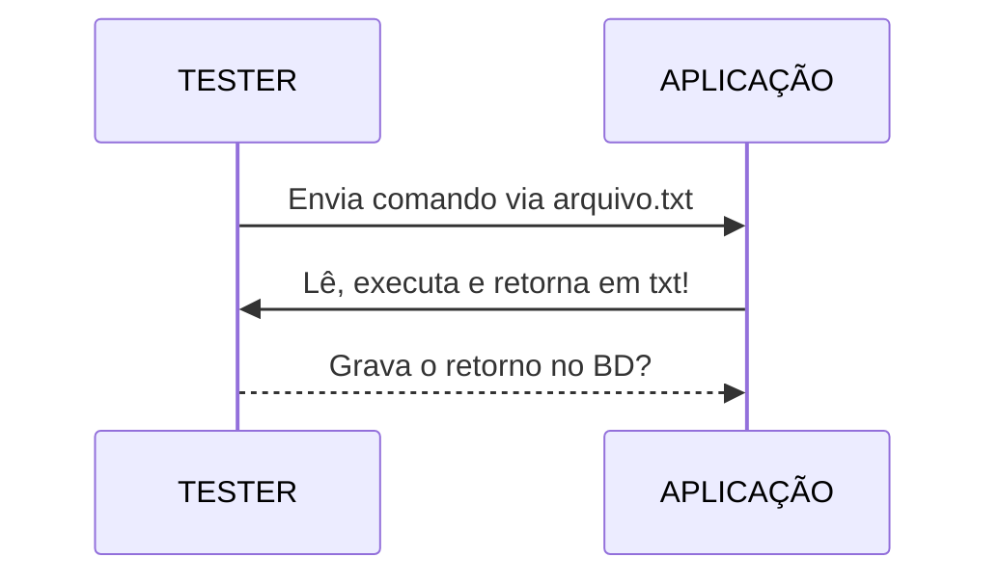

# Bem vindo ao Tester!

O Tester é uma ferramenta de teste de software, criado no Microsoft Visual Foxpro 9.0

Toda a integração com a aplicação que será testada é feita via arquivo.txt, consulte o manual.

# Sua aplicação

Você deve implementar na sua aplicação no Form base um Timer que monitore os arquivos do Tester e executando o conteúdo que o Tester vai escrevendo nele!

É muito importante que sua aplicação também tenha um modoteste e que ao clicar no executável se estiver em modoteste a mesma deve abrir sozinha!

# Como funciona

Aqui temos dois personagens, um é a ferramente de testes e outro e a sua aplicação que será testada!

Você deve fazer uma implementação do seu FORM base para que ela monitore os arquivos do Tester

# Banco de dados para cadastrar os planos de teste, etc

Ainda não está disponível o banco de dados para você cadastrar os planos de testes, isso ainda está sendo trabalhar para compartilhar, será um arquivo com os scripts sql para criação de tabelas no MySQL.

Vale notar que a ferramenta Tester quando aberta tenta se conectar com o banco de dados.

# Variáveis de ambiente

Você deve configurar suas variáveis de ambiente, pois o Tester irá lê-las ao abrir.

# Como escrever os testes?

Você deve cadastrar o nome dos testes no banco de dados e no próprio Tester dar dois cliques que ele deve gerar um arquivo de script para você programar o teste, exemplo de um teste você pode ver o arquivo ScriptsTeste/caso_1.txt
Leia o manual no arquivo Ajuda.rtf

# Mais

Se você não consegue ainda utilizar a ferramenta, é compreensível pois ainda faltam as tabelas de banco de dados e mais alguns exemplo, no entanto você tem o código fonte para estudá-lo!

# Contribua

Se você fizer novidades compartilhe conosco se desejar!

